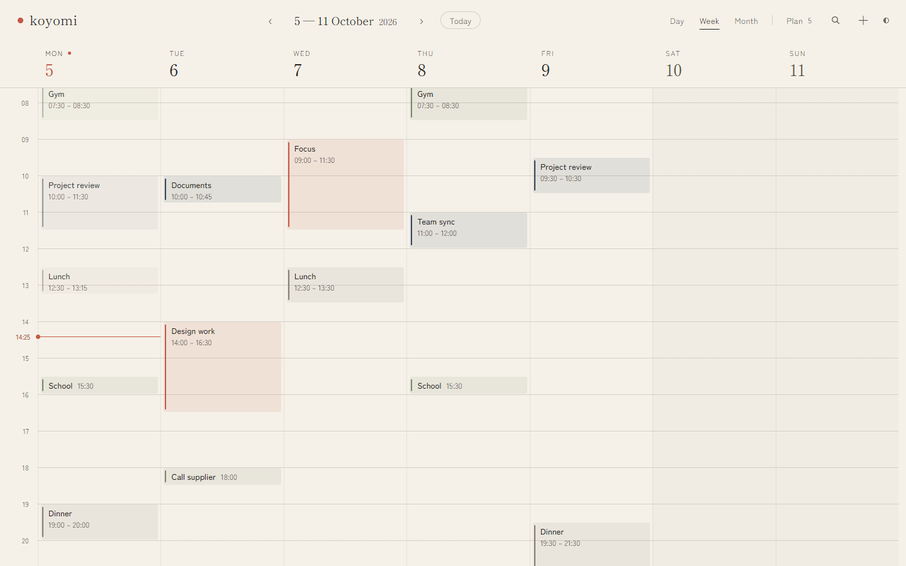
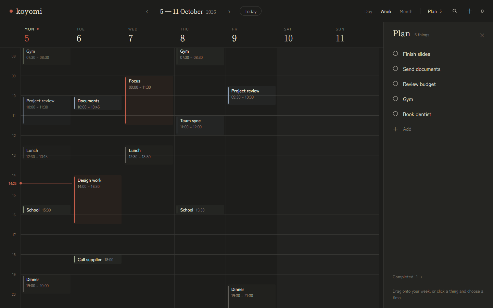

# Koyomi design baseline

The production app as it stands at the first local-first milestone (October 2026) is the approved
Koyomi visual baseline. It was ported from the approved Claude Design prototype and checked against
it side by side.

Do not redesign it. New work should be built in the same visual language, and any change to the look
below needs approval first.

## Screenshots

Taken from the production build with a neutral sample week, the clock set to Monday
5 October 2026, 14:25. Desktop is 1440×900; phone is 390×844 at twice the pixel density.
`npm run screenshots` retakes them all (with `npm run preview` running), along with the two
pictures the manifest shows when the app is installed.

| View | Light | Dark |
| --- | --- | --- |
| Desktop Week | [desktop-week-light.png](desktop-week-light.png) | [desktop-week-dark.png](desktop-week-dark.png) |
| Desktop Week + Plan | [desktop-week-plan-light.png](desktop-week-plan-light.png) | [desktop-week-plan-dark.png](desktop-week-plan-dark.png) |
| Desktop Month | [desktop-month-light.png](desktop-month-light.png) | |
| Phone Day | [mobile-day-light.png](mobile-day-light.png) | [mobile-day-dark.png](mobile-day-dark.png) |
| Phone Plan | [mobile-plan-light.png](mobile-plan-light.png) | |

Month and the phone Plan sheet are shown in light only: dark changes their palette and nothing else.

## What makes it Koyomi

- **Two palettes.** Light is warm paper; dark is ink at night. Every colour is a token in
  [app/globals.css](../../app/globals.css). The one accent is vermilion, used for the logo dot,
  today and the current time. Event colours are indigo (work), matcha (life), vermilion (focus)
  and a neutral grey (other, the default).
- **Two typefaces.** Shippori Mincho for the wordmark, dates and titles; Zen Kaku Gothic New for
  everything else.
- **Week first on a desktop, one day on a phone.** Below 760px the layout changes rather than
  shrinks: a week strip, a single day, and Plan as a bottom sheet.
- **Plan is a drawer.** 320px wide; it sits beside the calendar from 1100px and slides over it below
  that. Completed items stay collapsed at its foot.
- **Events are quiet, but present.** A 2px colour bar and a tint of the same colour: 10% on paper
  and 6% at night, about twice that when selected; struck through when a Plan item is done. Once
  past, the bar and tint drop to half strength and the text goes one step lighter, in both themes.
- **An event nobody has coloured is still easy to find.** Most events keep the default colour.
  On paper that is a neutral grey as strong as the other three colours, not the pale stone used
  for decoration, so an ordinary week does not dissolve into the background.
- **Quiet structure, readable information.** What a day is read by (event blocks, titles and
  times, hour labels, weekday labels) is set darker than the chrome around it. The background and
  the grid lines stay faint.
- **Text has levels, not opacity.** Every piece of text is set in one of a few named colours and
  is never dimmed by fading it, so its contrast is one that was chosen. All of it meets WCAG AA
  (4.5:1, or 3:1 for large text) in both themes, and `tests/e2e/readability.spec.ts` holds it there.

  | Level | Used for | On paper | At night |
  | --- | --- | --- | --- |
  | `ink` | Titles, dates, what you typed | 13.8:1 | 13.8:1 |
  | `ink2` | Secondary text, weekday labels, past event times | 6.9:1 | 8.5:1 |
  | `muted` | Navigation, hints, counts, the theme switch, days outside the month | 5.1:1 | 5.0:1 |
  | `event-time`, `hour` | Event times and the hour labels | 8.2:1 | 6.4:1 and 5.0:1 |
  | `verm-text` | Small vermilion text: today's date, the current time | 4.9:1 | 5.1:1 |
  | `stone`, `line` | Never text: rules, dots and outlines only | | |

- **Two vermilions, one accent.** The accent (`verm`) is for shapes: the logo dot, the now line,
  today's disc, an event's bar. On paper it is 3.9:1, too little for an 11px time, so small
  vermilion text uses `verm-text`, a shade deeper. One exception is deliberate: the numeral on
  today's disc on a phone stays paper on the accent itself (3.9:1 at 17px), because darkening
  the disc would change the accent.
- **The working day is on screen.** The hour height follows the window (44 to 58px) and the timeline
  opens just after 07:30, so about 08:00 to 20:00 is visible without scrolling.
- **Creation is one line.** Click a time, type, Enter: `14:00 │ What are you doing?`

## Differences from the prototype

Each of these was needed for a real calendar and was kept as small as possible:

- A search icon in both headers.
- The event popover edits in place (title, times, day) and has one extra row for colour and repeat.
  Mark done and Back to Plan appear only on events that came from Plan.
- The timeline covers 00:00 to 24:00 instead of 06:00 to 23:00.
- Overlapping events sit side by side.
- Text fields are 16px on phones, so iOS does not zoom when one is focused.
- The first visit follows the system's light or dark setting; after that the user's choice is kept.
- When the browser can install Koyomi, one line at the foot of Plan says "Install Koyomi". It is
  absent everywhere else: in Safari and Firefox, at any address but `app.koyomi.guru`, and once
  the app is installed.
- The app starts empty. The sample week exists only in these screenshots.

## The original prototype

The Claude Design export (`Kayomi (1).html`, about 16 MB, almost all of it embedded font data) is
deliberately not in the repository. It is listed in `.gitignore`. These screenshots and the
production code are the reference from here on.
